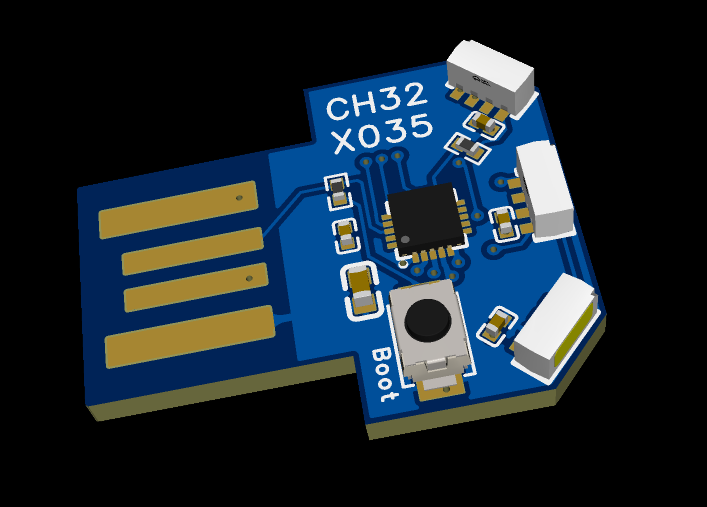

# Cylon

> A tiny open source / open hardware USB notification light — three side-emitting addressable LEDs on a USB-A stick, driven by a CH32X035 RISC-V MCU.



Cylon plugs straight into a USB-A port and gives you a programmable RGB indicator for build status, notifications, alerts, ambient lighting, etc. It is designed to be cheap, hackable, and easy to manufacture — the USB-A plug is formed by the PCB's own gold-finger edge connector, so there is no connector to solder.

The board speaks class-compliant **USB-MIDI**: the host drives everything with SysEx messages, so no driver is required and any MIDI-capable tool or browser can control it. Firmware can be updated over USB through the factory ROM bootloader.

## Features

- **USB-A PCB plug** — no cable or enclosure required, plugs directly into a host port.
- **CH32X035F8U6** — WCH RISC-V MCU in a small WQFN-20 package, with native USB 2.0 Full-Speed.
- **3× side-emitting WS2812B** (`XL-4020RGBC-2812B`) — individually addressable RGB, arranged so light spills out sideways/around the board. (Note: the mechanical strength of these LEDs is not ideal; a small amount of super glue, or different LEDs, improves it.)
- **USB bootloader + SWD** — flash over USB or via a WCH-LinkE / SWD probe.
- **Boot button** — hold it while plugging in to enter the ROM bootloader; a MIDI command can also reboot into it without touching the board.
- **4 spare GPIOs** — `PA0`–`PA3`, each usable as a push-pull output or a 20 kHz PWM output.
- **Minimal BOM** — just 7 components to order, all available from LCSC.
- **Open hardware** — full EasyEDA Pro project, schematic, PCB, Gerbers, and 3D model included.

## Hardware

| | |
|---|---|
| **MCU** | WCH CH32X035F8U6 (RISC-V, WQFN-20) |
| **USB** | USB 2.0 Full-Speed device (USB-A male PCB plug) |
| **LEDs** | 3× XL-4020RGBC-2812B (WS2812B-compatible, side-emitting) |
| **LED data** | `PB1` (`TIM1_CH3N`) → LED1 `DIN`, chained LED1 → LED2 → LED3 |
| **USB D+/D−** | `PC17` (`UDP`) / `PC16` (`UDM`) |
| **Debug** | SWD on `PC18` (`DIO`) / `PC19` (`DCK`) |
| **Boot** | `TS-1088-AR02016` tact switch + 5.1 kΩ resistor to `PC17` |
| **Power** | 5 V from USB, 10 µF bulk + 100 nF decoupling per LED/MCU |
| **Board** | 2-layer, ~23 × 19 mm (incl. USB plug tab), EasyEDA Pro, rev V1.0 |

### Pinout

| Signal | CH32X035 pin |
|---|---|
| WS2812 data out | `PB1` |
| USB `D+` | `PC17` (`UDP`) |
| USB `D−` | `PC16` (`UDM`) |
| SWD `DIO` | `PC18` |
| SWD `DCK` | `PC19` |
| PAD0 | `PA0` |
| PAD1 | `PA1` |
| PAD2 | `PA2` |
| PAD3 | `PA3` |
| `5V0` | `VDD` |
| `GND` | `GND` / EP |

> The WS2812 data line (`PB1`) feeds the first LED through a 100 Ω series resistor; each LED's `DO` feeds the next LED's `DI`, so all three are driven from a single GPIO.

### USB identity

| Field | Value |
|---|---|
| VID / PID | `0x16C0` / `0x27DD` |
| Manufacturer | `AREA3001` |
| Product | `CYLON` |
| Serial | `MD` + 6 hex chars of firmware version + 24 hex chars of the MCU UID |

Every board gets a unique serial number from its 96-bit chip UID; the version prefix also encodes which firmware it is running.

## Protocol

The device is a class-compliant **USB-MIDI** device that listens on **MIDI channel 0**. Control uses **System Exclusive (SysEx)** messages with the tag `13 37`:

```
F0 13 37 <record> ... F7          record = <address> <b1> <b2> <b3>
```

A message may contain any number of 4-byte records; the last write wins. Every payload byte is a **7-bit MIDI data byte** (`0x00`–`0x7F`).

| Address | Target | b1 / b2 / b3 |
| ------- | ------ | ------------ |
| `0x00` | all LEDs | r, g, b |
| `0x01`–`0x03` | LED 0/1/2 | r, g, b |
| `0x04`–`0x0A` | animation | base colour (wheels ignore it) |
| `0x0B` | firmware version reply (device → host) | major, minor, patch |
| `0x10`–`0x13` | `PA0`–`PA3` | type, level, ignored |
| `0x7F` | command | cmd, arg0, arg1 |

Unused/reserved addresses are ignored. The full protocol and the memory map live in [`docs/PROTOCOL.md`](docs/PROTOCOL.md).

### Static colours

```
F0 13 37 <led> <r> <g> <b> F7          led = 0x00 (all) or 0x01..0x03
```

`r`/`g`/`b` are 7-bit; the firmware shifts them left by one, so the LED receives an **even** 8-bit value and `0x7F` is the maximum (`0xFE`). Setting a static colour stops any running animation.

### Animations

Addresses `0x04`–`0x0A` start an on-device animation using the same record shape (the three colour bytes are the base colour):

| Address | Animation |
| ------- | --------- |
| `0x04` | blink at 1 Hz |
| `0x05` | blink at 2 Hz |
| `0x06` | breathe at 1 Hz |
| `0x07` | breathe at 2 Hz |
| `0x08` | Larson scanner (the moving dot) |
| `0x09` | colour wheel, one hue offset per LED |
| `0x0A` | colour wheel, all LEDs the same hue |

Animations are rendered on-device at 50 Hz; the host sends the record once.

### Auxiliary pins

`0x10`–`0x13` map to `PA0`–`PA3` (`TIM2_CH1..CH4`):

| Byte | Meaning |
| ---- | ------- |
| `<type>` | `0x00` push-pull output, `0x01` PWM output |
| `<level>` | push-pull: `0x00` low / `0x01` high<br>PWM: `0x00` = 0 % … `0x7F` = 100 % |
| last | ignored |

A pin stays an input until its first record and can switch between push-pull and PWM at any time. PWM runs at 20 kHz. Pins are independent of the LEDs and do not stop a running animation.

### Commands

Address `0x7F` is a command record `<0x7F> <cmd> <arg0> <arg1>`:

| Command | Meaning |
| ------- | ------- |
| `0x01` | reboot into the ROM USB bootloader |
| `0x02` | request firmware version |

Command `0x02` makes the device reply over the USB-MIDI IN endpoint with a normal record:

```
F0 13 37 0B <major> <minor> <patch> F7
```

For firmware `1.0.0` that is `F0 13 37 0B 01 00 00 F7`. Unknown commands and non-zero arguments are ignored.

### Examples

```
LED 0 red              F0 13 37 01 7F 00 00 F7
All LEDs green         F0 13 37 00 00 7F 00 F7
LED0 red, LED2 blue    F0 13 37 01 7F 00 00 03 00 00 7F F7
Larson scanner, cyan   F0 13 37 08 00 7F 7F F7
Colour wheel (offset)  F0 13 37 09 00 00 00 F7
PA0 high               F0 13 37 10 00 01 00 F7
PA1 PWM 50%            F0 13 37 11 01 40 00 F7
Reboot to bootloader   F0 13 37 7F 01 00 00 F7
Request firmware ver.  F0 13 37 7F 02 00 00 F7
```

## Firmware

The PlatformIO project lives in [`firmware/`](firmware), with a small vendored USB-MIDI stack in `firmware/lib/CH32X035_USB_MIDI`.

| File | Responsibility |
| ---- | -------------- |
| `main.c` | boot sequence, then `midi_run()` |
| `board.c/.h` | WS2812 driver (`TIM1_CH3N` + DMA1 ch5) and LED state |
| `midi.c/.h` | SysEx parsing, address map, commands |
| `anim.c/.h` | animation engine (free-running `TIM3` time base) |
| `pins.c/.h` | auxiliary `PA0`–`PA3` GPIO / 20 kHz PWM (`TIM2`) |
| `debug.c/.h` | delays and optional `printf` retargeting |

The WS2812 waveform is generated entirely in hardware: **TIM1** runs at 48 MHz with `ARR = 59` (1.25 µs per bit), **DMA1 channel 5** writes one compare value per bit to `TIM1_CH3N`, and the compare value *is* the bit's high time. On boot the firmware starts the LED driver and runs a ~3 s startup colour ramp that ends on LED 0 red, LED 1 green, LED 2 blue; it then brings up USB and enters the MIDI loop.

### Building

Prerequisites: [PlatformIO](https://platformio.org) and the [Community CH32V platform](https://github.com/Community-PIO-CH32V/platform-ch32v).

```bash
pip install platformio
pio pkg install -g -p "https://github.com/Community-PIO-CH32V/platform-ch32v.git#8cf3b51c0ee537756a04c28336f1466e03424020"

cd firmware
pio run -e release      # optimised, no logging
pio run -e debug        # -Og -g3 with serial logging on USART1 (PB10, 115200)
```

The platform is pinned to a commit so builds are reproducible. The output binary is `firmware/.pio/build/<env>/firmware.bin`. The firmware version comes from the `CYLON_VERSION` environment variable (e.g. a tag `v1.0.0`) and falls back to `1.0.0`; it is reported over USB-MIDI (command `0x02`) and encoded in the USB serial number.

### Flashing

`firmware/platformio.ini` sets `upload_protocol = isp`, so PlatformIO uses its bundled [`wchisp`](https://github.com/ch32-rs/wchisp):

```bash
cd firmware
pio run -e release -t upload
```

Put the board into the ROM bootloader first — **unplug USB, hold BOOT, plug USB back in**. The BOOT button pulls `PC17` (the boot-detection pin, which doubles as USB `D+`) high at power-up; the pin is sampled only once, on reset. The bootloader enumerates as a WCH ISP device (`4348:55e0` / `1a86:55e0`).

You can skip the button by asking a running board to reboot into the bootloader over MIDI:

```bash
uv run tools/set_leds.py --boot
cd firmware && pio run -e release -t upload
```

SWD (`PC18`/`PC19`) is the button-free alternative and does not depend on the boot strap. On Windows you may need to bind the bootloader to WinUSB with [Zadig](https://zadig.akeo.ie/). On Linux, grant access with a udev rule and reload it:

```
# /etc/udev/rules.d/60-wchisp.rules
SUBSYSTEM=="usb", ATTR{idVendor}=="4348", ATTR{idProduct}=="55e0", MODE="0666"
SUBSYSTEM=="usb", ATTR{idVendor}=="1a86", ATTR{idProduct}=="55e0", MODE="0666"
```

```bash
sudo udevadm control --reload-rules && sudo udevadm trigger
# replug the board and restart the browser
```

### Releases

Pushing a `v<major>.<minor>.<patch>` tag runs [`.github/workflows/release.yml`](.github/workflows/release.yml): it builds the `release` environment with `CYLON_VERSION` set from the tag and attaches `firmware.bin` and `cylon-<tag>.bin` to a **draft** GitHub release. Publish the draft to make the version available to the web tool's updater.

## Web control & firmware update

[`public/`](public) is a responsive static page (published to GitHub Pages) for controlling the board from a Chromium browser:

- LED colours and animations, the four I/O pins, and the live firmware version;
- firmware updates over USB — it lists versions from this repository's GitHub releases, can reboot the board into the bootloader, and flashes over WebUSB.

It uses **Web MIDI** for control and **WebUSB** for flashing, so it needs Chrome or Edge (desktop or Android) over HTTPS. Once deployed it is at `https://melazarus.github.io/cylon/`; the Pages workflow is [`.github/workflows/pages.yml`](.github/workflows/pages.yml) and the repository's Pages source must be set to **GitHub Actions**.

## Command-line and single-file tools

[`tools/set_leds.py`](tools/set_leds.py) is a [uv](https://docs.astral.sh/uv/) / PEP 723 script (it pulls in `pygame` for its MIDI backend):

```bash
uv run tools/set_leds.py 0 ff0000     # LED 0 red
uv run tools/set_leds.py all ffffff   # all LEDs white
uv run tools/set_leds.py 0 red        # named colours
uv run tools/set_leds.py --list       # list MIDI output ports
uv run tools/set_leds.py --boot       # reboot into the ROM bootloader
uv run tools/set_leds.py --version    # read the firmware version
```

Named colours: `off`, `black`, `red`, `green`, `blue`, `white`, `yellow`, `cyan`, `magenta`, `orange`, `purple`, `pink`. The port is auto-detected by matching `"cylon"`; use `--port` if your system names it differently. [`tools/set_leds.html`](tools/set_leds.html) is a single-file Web MIDI page with the same LED/pin/animation controls for quick local use.

## Repository layout

```
.
├── .github/workflows/        # GitHub Pages deploy + tagged firmware releases
├── docs/
│   └── PROTOCOL.md           # USB-MIDI protocol reference
├── firmware/                 # PlatformIO firmware (CH32X035) + version.py
├── hardware/                 # EasyEDA Pro project, schematic, PCB, gerbers, BOM, 3D
├── images/
│   └── render_front.png      # Board render
├── public/                   # Static web tool (deployed to GitHub Pages)
├── tools/                    # Python CLI + single-file browser tool
├── LICENSE
└── README.md
```

## Contributing

Issues, pull requests, and hardware/firmware forks are all welcome. If you build one, share a photo!

## License

Released under the [MIT License](LICENSE). © 2026 Hans Polders.
